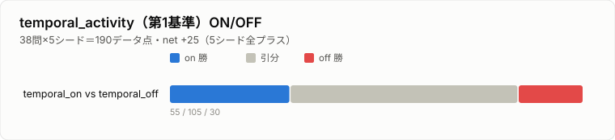
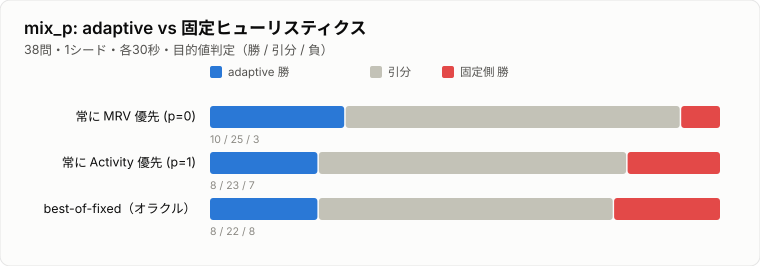
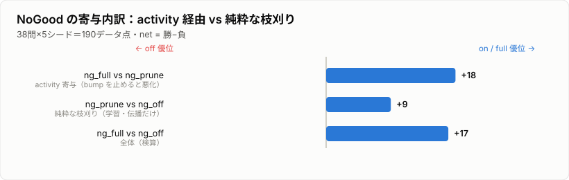
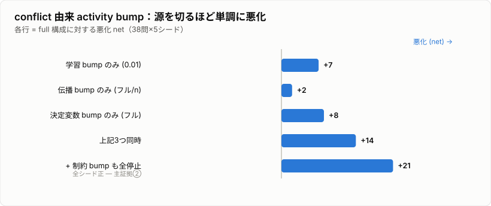
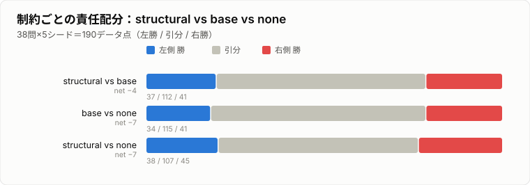
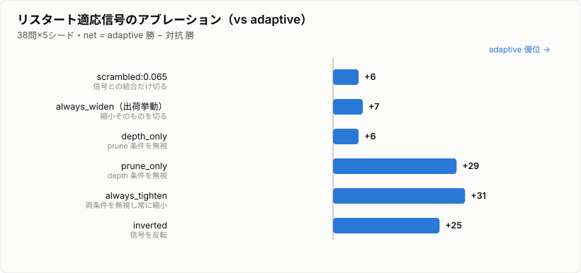
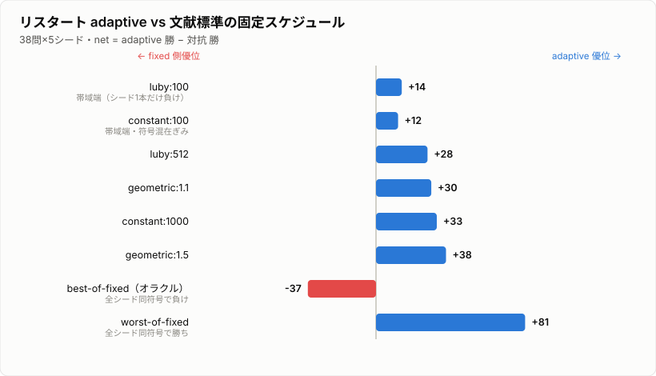
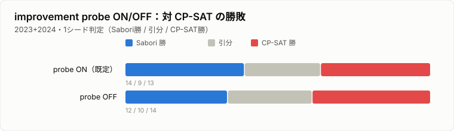

# 自作 CP ソルバー sabori_csp の探索アルゴリズム：CDCL / LCG / MiniZinc 系と何が違うのか

> 短い版: [search-algorithm-short.md](search-algorithm-short.md) ／ English: [full](search-algorithm-explained-en.md) · [short](search-algorithm-en-short.md)

## TL;DR

sabori_csp は FlatZinc 対応の C++ 制約ソルバーです。骨格（バックトラック探索 + 伝播 + リスタート + activity 変数選択 + NoGood 学習）は現代の CP / SAT と共通で、新しい探索アルゴリズムを発明したわけではありません。個性は、explanation（説明生成）を持たない軽量な作りのまま、標準部品の上に薄い「適応・学習レイヤ」を重ねた点にあります。

一言で言うと、**LCG が「論理」で無駄な探索を演繹的に止めるのに対し、sabori_csp は同じ矛盾情報を「傾向」（最近揉めた変数へ寄せる conflict-directed なヒューリスティクス）に流し込んで止める**、という違いです。ただし演繹的枝刈りが一般に不要という主張ではありません。sabori は意図的に最弱の学習（判定リテラルの連言）しか持たず、測っているのは「論理を最小化したとき傾向だけでどこまで運べるか」。強い学習（1UIP/LCG）が決定打になるクラスは射程外です。

各機能を A/B 計測で切り分けた結論は、**効いたのは「基盤」の方**でした。探索を動かすのは、再開地点を決める `temporal_activity`（Last Conflict 系）と、降下を駆動する activity の2本で、これを供給する NoGood 学習と mix_p バンディットも効く。逆に、その上に乗せた「賢い精緻化」（Bloom タイブレーク、制約ごとの責任配分、擬似勾配）は、単体ではほぼ報われませんでした。以下、各機能を既存技法と対比しながら A/B 計測で見ていきます。

---

## 0. 前提：標準部品と計測の約束

比較の土台として、現代的なソルバーが共有している部品を先に並べておきます。

| 層 | SAT（CDCL）系 | CP / LCG 系 | 代表例 |
|---|---|---|---|
| 変数選択 | VSIDS（activity） | MRV / dom-wdeg / IBS / CHB | MiniSat, Chuffed, Choco |
| 値選択 | phase saving | min/max/中央値、solution-guided | Glucose, OR-Tools |
| 矛盾の学習 | 1UIP 節学習（含意グラフ解析） | LCG（伝播を節に変換して学習） | Chuffed |
| リスタート | Luby / 幾何 / LBD 動的 | 同左 | Glucose |
| 高速伝播 | 2-watched literal | ドメイン伝播 + watched | 各種 |

sabori_csp はこのうち、

- **2-watched literal**（NoGood 伝播）
- **VSIDS 風の activity**（減衰・rescale 付き）
- **MRV（最小ドメイン優先）**
- **リスタート**
- **branch-and-bound**（最適化）

を「素直に」実装しています。ここまでは教科書どおりです。ただし変数選択の第1基準だけは VSIDS でも MRV でもなく、別の信号 `temporal_activity` で、これが実は探索を一番動かしている。この点が後で効いてくるので、1 章で詳しく述べます。

### 数字の読み方（計測の約束）

以降の A/B 計測は、MiniZinc Challenge 2023+2024 を各 30 秒の wall-clock で走らせ、**解の目的値の良し悪し**で勝敗を判定します（タイムは使わない。クロックジッタで反転するため。同値なら最適性証明の有無で判定）。対象問題数とシード数は測定ごとに記しますが、標準は 38 問 × 5 シード（190 データ点）で、表の `net` は「勝ち − 負け」です。一部（mix_p や対 CP-SAT 判定など）は 1 シードで、その旨は都度断ります。数字には3つの読み方の約束があります。

- **分散帯と頑健性**。net が ±10 を下回る差は分散帯で、絶対水準は run で揺れます。頑健なのは2つだけ。同一 run 内の単調性（源を増やすほど悪化する等）と、全シード同符号です。ただし全シード同符号でも margin が小さければ「方向の示唆」止まり（5/5 同符号は二項分布で p≈0.06）。以降、net が小さい結果は「効く向き」だけを主張し、大きさは主張しません。
- **差分値と孤立値**。ablation の多くは「フル構成からその機構だけを抜いた悪化」＝**差分値**です。差分値は条件づきで、上位の選択基準が下位の寄与をマスクします。強い第1基準 `temporal_activity` がバックトラック直後の手を決めてしまうと、その下で降下を駆動する activity を抜いても悪化は小さく見える。機構の真の重みを知るには、上位基準を外した**孤立値**も併記します（実例は 3 章の activity。差分 +21 / 孤立 +81）。以降「差分／孤立」と出たら、この原理を指します。
- **直接対決とフィールド指標**。上の目的値判定は「2 構成のどちらが良い目的値か」を見る**直接対決**です。一方 Challenge の実ゴールは「フィールド（CP-SAT 等）に何問勝てるか」で、閾値を跨ぐ少数の問題が効く。2指標は一般に近いが、必ずしも一致しません。この記事の「効かない／余剰」系の結論（2 章 Bloom、4 章 構造特化、7 章 勾配）はすべて直接対決で出したもので、フィールド指標で裏取りしたのは 7 章の probe だけ。そこでは逆転しました。他章の負け結論は「直接対決ではこう」と限定して読むのが正確です。

以下、比較軸ごとに「標準」と「sabori_csp の振り方」を対比していきます。

---

## 1. 変数選択：固定ヒューリスティクスではなく「混合比を学習する」

### 既存技法

変数選択は CP / SAT の性能を最も大きく左右する部分で、歴史的に多くの手法が提案されてきました。

- **VSIDS**（SAT）：矛盾に関与した変数の activity を加算し、減衰させる。「最近よく揉めている変数」を優先。
- **MRV / fail-first**（CP）：ドメインが最小の変数を選ぶ。失敗を早く引き当てて枝刈りする。
- **dom/wdeg**：ドメインサイズを制約の重み（失敗回数）で割る。
- **IBS（Impact-Based Search）/ CHB**：割当が探索空間をどれだけ縮めたかの「インパクト」や、報酬ベースで選ぶ。
- **Last Conflict（LC）**（Lecoutre, Saïs, Tabary, Vidal 2009）：矛盾が起きたら、その矛盾に関与した変数を、解消されるまで主ヒューリスティクスに優先して選び続ける。安価で強力な conflict-directed 順序付け。

実務的には「MRV と activity をどう混ぜるか」がチューニングのキモになりますが、**多くのソルバーは 1 つに固定するか、静的なルール（例：MRV を主、activity をタイブレーク）に決め打ち**します。

### sabori_csp の振り方①：第1基準は conflict-directed な `temporal_activity`（Last Conflict 系）

まず、sabori_csp の変数選択は「activity か MRV か」が主役ではありません。**最優先の第1基準は `temporal_activity`** という別の信号です（`src/core/variable_selector.cpp`）。これは各変数について **矛盾で +1 / 割当成功で −1** する recency カウンタで、選択は次の階層になっています。

```
1. temporal_activity 最大（= 直近の未解消の矛盾に関与した変数）   ← 第1基準
2. （同点なら）mix_p で activity 優先 / MRV 優先                  ← タイブレーク
3. （さらに同点なら）NoGood-Bloom 重なり（2 章）                  ← さらに下
```

つまり「いま揉めている変数を、片付くまで掘り続ける」を最優先にし、揉めていない（`temporal_activity = 0` の）変数群の中で初めて activity/MRV が効く。これは Last Conflict（Lecoutre et al. 2009）に着想を得た拡張です。古典 LC が「最後の1変数を強制」なのに対し、こちらはカウンタ化し、成功で減衰させ、複数変数へ広げた conflict-directed 順序付けになっています。

#### 実測：単体で最も寄与が大きい

この第1基準がどれだけ効いているかを ON / OFF で測りました（環境変数 `SABORI_TEMPORAL`、`bench_temporal.py`。OFF は `temporal_activity` を増やさず全変数 0 にし、mix_p/MRV へフォールスルー）。38 問×5 シード・目的値判定。

| 比較 | on 勝 | off 勝 | 引分 | net |
|---|---|---|---|---|
| temporal_on vs temporal_off | 55 | 30 | 105 | **+25** |



net +25 で **5 シードすべてプラス**（+5/+5/+4/+2/+9）。これは「フル構成からこの第1基準だけを抜いたときの悪化（他の機構は残したままの差分的な寄与）」で、その意味では最大の単一レバーです。conflict-directed search が CP で強いという定説どおり、強力な override です。

ただし「第1基準が一番効くから activity は脇役」と読むのは間違いです。`temporal_activity` が効くのはバックトラック直後の最初の1手（last-conflict 変数の選択）が中心で、そこから順調に木を降りていく間は `temporal_activity` がほぼ全変数 0。その降下の大半は activity（と MRV）が駆動しています（計装で確認。未割当の hot 変数は多くの問題で選択の数 % しかない）。

つまり temporal が「再開地点」を決め、activity が「そこからの降下」を決める、という探索フェーズの分担です。

activity の真の寄与は、上位の temporal を外して測る孤立値（§0 の計測規約参照）でこそ出ます。その孤立値は 3 章で +81。降下を一手に引き受ける主役です。後述の mix_p はこの activity 軸の混合比を調整するもので、脇役のタイブレークではありません。

### sabori_csp の振り方②：タイブレークの混合比をバンディット学習

第1基準（`temporal_activity`）が同点になったとき、初めて「activity 優先か MRV 優先か」が効きます。sabori_csp はこの**タイブレークの混合比**を **0.0 / 0.25 / 0.5 / 0.75 / 1.0 の 5 段グリッド**で表し、`mix_p` を**リスタートごとに強化学習で抽選し直します**（`include/sabori_csp/mode_reward_policy.hpp`）。

```cpp
// mode_reward_policy.hpp（抜粋・要約）
double signal = improvement_ ? 2.0                      // 改善あり → 強い報酬
                             : 1.0 / (1 + max_depth_);  // 改善なし → 到達深さで薄い報酬
for (size_t i = 0; i < kGridSize; ++i) {
    double bucket_signal =
        (i == p_idx_)            ? signal        // 使ったバケットに報酬
      : (隣接バケット)            ? 0.1 * signal  // 隣にも薄く配る（平滑化）
                                 : 0.0;
    reward_[i] = kDecay * reward_[i] + (1 - kDecay) * bucket_signal;  // EMA 更新
    reward_[i] = std::max(reward_[i], kFloor);                        // 探索維持の床
}
// reward_ に比例して次の mix_p を確率的に再抽選
```

要するに **5 本腕のマルチアームド・バンディット**です。

- 各腕（混合比）が EMA で報酬を持つ。なお、VSIDS の activity 減衰自体も「矛盾信号の EMA」だと厳密に定式化できる（Liang & Ganesh ら 2015、[arXiv:1506.08905](https://arxiv.org/abs/1506.08905)：正規化 VSIDS は `s_n = (1−f)·δ_n + f·s_{n−1}`）。ここではその EMA の発想を、変数の activity でなく**ヒューリスティクスの報酬**へ一段上げて適用している。
- 直近リスタートで改善（SAT / probe 成功）があれば強い報酬、なければ「到達深さの逆数」という弱いシグナル。
- 報酬に比例して次の混合比を抽選。`kFloor` で全腕に最低確率を残し、隣接バケットへ 0.1 倍配ることで報酬地形を平滑化。

**既存技法との違い**：VSIDS も dom/wdeg も「変数のスコア」を適応させますが、sabori_csp が適応させるのはヒューリスティクスそのものという一段メタな量です。ただし先行研究があります。「変数選択ヒューリスティクスをバンディットで online に選ぶ」というアイデア自体は新しくありません。Xia & Yap「Learning Robust Search Strategies Using a Bandit-Based Approach」（[arXiv:1805.03876](https://arxiv.org/abs/1805.03876)、2018）は、ddeg/dom・wdeg/dom・impact・activity を腕にした MAB を CSP 探索に組み込み、まさにここでの結論と同じ「robustness（最悪の固定を避ける）」に行き着いています。

sabori の振り方が違うのは細部です。①腕が「別個のヒューリスティクス」ではなく 2 つ（MRV/activity）の混合比を 5 段に離散化した連続量、②バンディットが Thompson Sampling/UCB1 ではなく EMA 報酬 + 隣接バケットへの平滑化 + 探索維持の床、③抽選が探索ノードごとではなくリスタートごと。「バンディットで変数選択を適応させる」枠組みは Xia & Yap に従い、その中で混合比という連続軸・EMA・リスタート粒度に振った、というのが実際です。

#### 実測：adaptive は「最悪の固定を避ける」robustness を生む

同じバイナリで `mix_p` を固定／適応に切り替え（環境変数 `SABORI_FIX_MIXP`）、38 問・**1 シード**・各 30 秒で判定した結果が次です（判定規約は §0。`benchmarks/minizinc_challenge/bench_mixp.py`）。

| 比較 | adaptive 勝 | 固定側 勝 | 引き分け |
|---|---|---|---|
| adaptive vs **常に MRV 優先**（p=0） | **10** | 3 | 25 |
| adaptive vs **常に Activity 優先**（p=1） | 8 | 7 | 23 |
| adaptive vs **問題ごとの best-of-fixed**（オラクル） | 8 | 8 | 22 |



要点はこうです。

- adaptive は「常に MRV」を明確に上回る（10–3）。例：`yumi-static`（MIN, adaptive=635 / MRV=920 / Act=968）、`roster-shifts-bool`（MAX, adaptive=4098 / 固定=3189）など、固定では大きく劣る問題を adaptive が拾う。
- 「常に Activity」とはほぼ互角（8–7）、問題ごとに最良の固定を選ぶオラクルとは完全な互角（8–8）。

adaptive の価値は「どの固定ヒューリスティクスにも明確に勝つ」ことではありません。**問題ごとに当たり外れのある固定選択の、最悪ケースを自動で回避し、best-of-fixed に追従する robustness** です。バンディットが報酬の高い腕へ寄っていく挙動として理にかなっています。速さを稼ぐのではなく、事前に最適なヒューリスティクスを選べない状況での保険です。

> 動的な性質についての推測（未計測）：mix_p をリスタートごとに抽選し直す設計は、問題間の当たり外れだけでなく**探索の時間変化**にも適応しうる。探索初期は activity の情報がまだ薄く、ドメインサイズに基づく MRV の方が頼りになる。探索が進んで矛盾が蓄積するにつれ activity の信頼度が上がり、activity 寄りの腕が報われるようになる。この時間方向のシフトに、バンディットが追従している可能性があります。ただしこれは機構から見た推測であって、時間方向の mix_p 推移そのものは計測していません。

> 注：上記は単一マシン・1 シード・30 秒・38 問という限定的な計測です。乱数シードや時間制限を変えれば引き分け帯（SOL 同士）の数問は入れ替わり得ます。

---

## 2. NoGood-Bloom 重なり：学習制約への「絡み具合」でタイブレーク

### 既存技法

VSIDS の本質は「学習節に多く現れる変数ほど activity が高い」という点にあります。つまり activity は「学習した知識への関与度」の集計値です。CP 側の dom/wdeg も「失敗した制約の重み」を変数に伝播させる発想で、根は近いものです。

### sabori_csp の振り方：Bloom 指紋の AND-popcount

sabori_csp は、activity とは別の角度から「**現在の探索パス上で選んできた変数たちが登場する学習 NoGood 群に、この未割当変数はどれだけ絡んでいるか**」を**定数時間で近似**します（`src/core/variable_selector.cpp` の `select_linear`）。

仕組みは次のとおりです。

- 各 NoGood に通し番号を振り、その ID から `Bloom512`（`uint64_t w[8]`、512 ビットのブルームフィルタ）の指紋を生成する。
- 各変数には「自分が登場する NoGood 群の指紋を OR したもの」（`var_ng_bloom`）を持たせる。
- 探索で 1 変数を判定する（割り当てる）たびに、**その変数の `var_ng_bloom`** を**現在パスの累積 Bloom**（`ng_usage_bloom_`）に OR していく（`ng_usage_bloom_ |= model.var_ng_bloom(...)`）。

ここで重要なのは、累積 Bloom が表すのは「**パス上で選んだ変数が登場する NoGood 群の指紋**」であって、**NoGood が実際に発火・伝播した履歴ではない**点です。あくまで「どの学習制約に近い領域を掘っているか」の近似指標です。

```cpp
// variable_selector.cpp（抜粋）
if (tied && use_bloom) {
    int ng_overlap = (model.var_ng_bloom(i) & ng_usage_bloom).popcount();
    if (ng_overlap > best_ng_overlap) { better = true; ... }
}
```

第1基準 `temporal_activity`（1 章）も、その下の activity/MRV も同点になったとき、つまり選択階層の最下層で、**「候補変数の NoGood 指紋」と「現在パスの累積指紋」の AND を取り、立っているビット数（popcount）が多い変数を優先** します。

直感的には「**いま掘っている探索パスが関わる学習制約群と、最も指紋が重なる未割当変数**」を選ぶことになります。確定的に「同じ NoGood を共有するか」を毎回照合すると重いので、Bloom フィルタで**衝突を許す代わりに、`uint64_t` 8 ワード（512 ビット）の AND + popcount に潰している**のがポイントです。

**既存技法との違い**：VSIDS が「過去の学習を 1 本のスカラー activity に集約」するのに対し、これは「現在パス固有の文脈で、どの学習制約と近い領域を掘っているか」をビットベクトルで持ち、それとの重なりで選ぶ。文脈依存・近似・定数時間という組み合わせになっています。なお、これは選択階層の最下層のタイブレーク（第1基準 temporal_activity も activity も MRV も同点のとき）であり、主たる選択基準ではありません。出番が滅多に来ないのも当然で、後述のとおり 93% の局面で no-op でした。

#### 実測：ほとんど発火せず、効果も出ない

このタイブレークを ON / OFF で切り替えられるようにして計測しました（環境変数 `SABORI_BLOOM`、`benchmarks/minizinc_challenge/bench_bloom.py`）。OFF 時は `ng_usage_bloom_` を蓄積しないので、同点時のタイブレークが発火しません。条件は 4 章と同じで、MiniZinc Challenge 2023+2024 の 38 問・各 30 秒・**5 シード**・目的値判定、`(問題 × シード)=190` データ点です。

| 比較 | on 勝 | off 勝 | 引分 | net |
|---|---|---|---|---|
| bloom_on vs bloom_off | 5 | 9 | **176** | **−4** |


ここで目を引くのは、**引分が 190 中 176（93%）**という事実です。

- このタイブレークは滅多に結果を変えません。Bloom が勝敗を分けたのは 14 ケースだけ。残り 93% は ON でも OFF でも同じ解にたどり着きます。MRV と activity が同点で、かつ Bloom 重なりが決め手になる局面が、そもそも稀ということです。
- 発火した 14 ケースでは OFF が僅差で勝ち越し（9–5）。ただし n=14・net −4 はノイズ帯で、「有害」と断ずるには弱い。

**Bloom タイブレークはこの問題集では測定可能な利得を生んでおらず、93% の局面で no-op** です。変数選択というホットパスに「候補ごとに 512 ビットの AND + popcount」を足しているコストを考えると、現状のタイブレークという使い方は割に合っていません。「撤去」と言い切るより一段ソフトに、指紋インフラ（`var_ng_bloom`）自体は残しつつ、タイブレーク以外の使い道を探すか、見つからなければ撤去、とするのが妥当です。

なぜ効かないのかには心当たりがあります。NoGood が変数選択に効く主経路は、この Bloom タイブレークではなく activity の方だからです。NoGood は学習時（`learn_from_conflict`）にも、発火して枝刈りした伝播時（`propagate_*` 内）にも、関与した変数の activity を bump しています。つまり「いま掘っている領域に関わる学習制約」という情報は、すでに activity という太いパイプを通って変数選択に効いている。Bloom タイブレークは同じ情報をより細い別パイプで届けようとするものですが、activity が先に決着するので出番が回ってこない。3 章で NoGood 自体は効いていた（後述）のに、その上澄みのタイブレークだけ効かない、という構図はこれで腑に落ちます。これも独立な話ではなく、activity が構造的中心性（どの制約クラスタに近いか）を暗黙に encode しているという Liang & Ganesh ら 2015（[arXiv:1506.08905](https://arxiv.org/abs/1506.08905)、コラム参照）の知見と表裏一体です。だから「構造近接」を明示的に足すタイブレークは冗長になります。

---

## 3. NoGood 学習：CDCL の 1UIP ではなく「決定トレイルの連言」

### 既存技法

- **CDCL（SAT）**：矛盾が起きると含意グラフを遡り、**1UIP（First Unique Implication Point）**で切って学習節を作る。「最小限かつ強力な」節を学習でき、非時系列バックジャンプ（backjump）の駆動力になる。
- **LCG（Chuffed など）**：CP の各伝播器に「なぜこの値を消したか」の説明（explanation）を実装させ、伝播そのものを節に変換して CDCL 機構に載せる。CP と SAT の良いとこ取り。
- **Generalized NoGoods from restarts**（Lecoutre ら, 2007）：リスタート時に、現在の決定列から NoGood を記録する軽量手法。1UIP より弱いが実装が容易。

### sabori_csp の振り方：decision-trail NoGood

sabori_csp は **含意グラフ解析（1UIP）も LCG も行いません**。矛盾に至ったときの **decision_trail（その時点までの「判定リテラル」の列）をそのまま 1 つの NoGood にします**（`src/core/nogood_manager.cpp` の `learn_from_conflict`）。

```cpp
void NoGoodManager::learn_from_conflict(const std::vector<Literal>& decision_trail, ...) {
    if (decision_trail.size() >= 2) {
        add_nogood(decision_trail, restart_count);   // 判定列の連言を NoGood 化
        for (const auto& lit : decision_trail)
            activity[lit.var_idx] += activity_inc * 0.01 / decision_trail.size();
    } else if (decision_trail.size() == 1) {
        unit_nogoods_.push_back(decision_trail[0]);   // 単位 NoGood
    }
}
```

リテラルは `Eq`（`x == v`）/ `Leq`（`x <= v`）/ `Geq`（`x >= v`）の 3 種で、伝播は **2-watched literal**（SAT と同じ）。単位 NoGood はドメインに直接適用されます。

**既存技法との違い**：これは 1UIP より明確に「弱い」学習です。含意を遡らないので、学習される NoGood は決定リテラルのみで構成され、最小性も保証されません。その代わり、

- 伝播器ごとに explanation を書く必要がない（LCG の重い前提が不要）、
- 実装が単純で、どんな制約にも一律に効く、

という割り切りになっています。LCG ほど賢くないが、全制約に均一に適用できる軽量学習、というのが正確なところです。なぜ 1UIP / LCG にしなかったのか。理由は実装コストと汎用性のトレードオフに尽きます。

#### 実測：弱くても、効いている

「LCG より弱い」と言うと効かなそうですが、計測すると**この弱い NoGood は確かに効いています**。学習＋伝播をまるごと ON / OFF できるようにして比較しました（環境変数 `SABORI_NOGOOD`、`benchmarks/minizinc_challenge/bench_nogood.py`）。OFF 時は NoGood を学習も伝播もしません。38 問・各 30 秒・**5 シード**、`(問題 × シード)=190` データ点です。

| 比較 | on 勝 | off 勝 | 引分 | net |
|---|---|---|---|---|
| ng_on vs ng_off | 54 | 36 | 100 | **+18** |


net +18 自体は控えめですが、**5 シードすべてプラス**（+4 / +3 / +2 / +2 / +7、符号反転なし）。これは mix_p（1 章）と並ぶ、数少ない「一貫して効いている」結果です。後続の Bloom（2 章）や構造特化（4 章）、勾配（7 章）がどれもシードで符号反転したのと対照的に、NoGood だけは全シード同符号。弱い decision-trail 学習でも、枝刈りと activity 寄与で確かに探索を助けている、と読めます。

ただし、この `SABORI_NOGOOD=0` は NoGood 機構を丸ごと止めています。学習・伝播による枝刈りだけでなく、NoGood が関与変数の activity を bump する経路（学習時 `learn_from_conflict`、伝播時 `propagate_*`）も同時に切っている。なので +18 は「純粋な枝刈り効果」ではなく、枝刈りと activity 寄与をまとめた値です。そこで、枝刈りは残したまま activity bump だけ止める第 3 のモード（`SABORI_NG_NOBUMP=1`）を足して、内訳を分離しました。

| 比較 | 何を測る | net |
|---|---|---|
| ng_full vs ng_prune | activity 寄与（bump を止めると？） | **+18**（seed 別 +9/+2/+2/0/+5、一貫） |
| ng_prune vs ng_off | 純粋な枝刈り（学習・伝播だけ） | **+9**（seed 別 0/+7/−1/0/+3、ばらつく） |
| ng_full vs ng_off | 全体（検算） | +17（先の +18 とほぼ一致） |



結果ははっきりしています。**NoGood の価値は主に activity bump 経由** です。bump を止めた瞬間に net +18 ぶん悪化する（しかも符号反転なし）のに対し、純粋な枝刈りの寄与（+9）は小さく、シードでばらつく。「弱い学習でも効く」の中身は、節による枝刈りそのものより、その節が activity を太らせて変数選択を導く効果の方が大きい、ということです。

#### さらに分解：activity の供給は「冗長な代替」

では、その activity を太らせている源のうち、どれが効いているのか。conflict 由来の activity bump には実は複数の経路があります。NoGood 学習時（`learn_from_conflict`、ただし `activity_inc × 0.01` の極小スケール）、NoGood 伝播時（`propagate_*`、`activity_inc / n` のフルスケール）、そして決定変数 bump（`handle_failure`、`activity_inc` フルスケール・常時 ON で、実は単発では最大）。各経路を単体で／まとめて切って計測しました（`bench_ng_compensation.py`、同じ 38 問×5 シード）。

| 切るもの | net（full に対する悪化） |
|---|---|
| 学習 bump のみ（0.01） | +7 |
| 伝播 bump のみ（フル/n） | +2 |
| 決定変数 bump のみ（フル） | +8 |
| 上記 3 つ同時 | +14 |
| + 制約 bump も（= conflict 由来の activity bump を全停止） | **+21（全シード正）** |



予想は全部外れました。スケールで言えば最小の「学習 bump（0.01）」が単体では伝播 bump（フルスケール）より効き（+7 vs +2）、最大の決定変数 bump も単体では +8 止まり。どの単体も小さい。だが切る源を増やすほど単調に悪化し、全部切ると +21（全シードでプラス）。つまり「冗長な代替」の構造を持っています。ポイントは次のとおりです。

- **activity による傾向制御そのものは、確かに効く**。conflict 由来の bump を全部切ると +21、しかも全シード一貫。前段の中心的な主張はむしろ補強されました。
- だが供給経路は互いに代替可能で、特定の 1 チャネルに帰属できません。1 つ抜いても残りが補償する。「どのチャネルが効くか」ではなく「ある程度の量があるか」が問題。
- per-event のスケールは効き目を予測しない。0.01 の学習 bump が効くのは、毎 conflict・全 decision-trail 変数に効く（頻度×範囲）から。累積 = 大きさ × 頻度 × 範囲、です。

> 注：前掲 `ng_full vs ng_prune = +18` と、ここの「3 つ同時 = +14」が一致しないのは、30 秒 wall-clock 判定の run 間ブレです。頑健なのは同一 run 内の単調性と「全停止 +21・全シード正」の方で、個々の net の絶対水準は run で揺れます。なお `fails` で見ると全停止は激減しますが（一見「速い」）、目的値で見ると最悪。productive に探索せず失敗が減っただけで、目的値判定でなければ逆の結論を出すところでした。

#### 孤立値での検算：activity を抜く真の悪化は +81

上の「全停止 +21」は temporal ON での差分値です（差分／孤立の区別は §0 の計測規約参照）。temporal を外した孤立値を `bench_temporal_mask.py` で測ると、activity 機構の全停止は **+81**（同一 run・全シードで full が 94–13 と大きく上回る）。差分 +21 は temporal にマスクされて圧縮された見かけで、activity の真の寄与は +81、降下を一手に引き受ける主役です。ここで「冗長な代替」と言えるのは activity を供給する bump 源が互いに代替可能という話に限られ、activity による変数選択そのものは脇役ではありません。

なお本プロジェクトには LCG 系の実験ブランチも存在しますが、本流（main）の探索は上記の decision-trail 方式です。

---

## 4. explanation を持たないソルバーは、どう「矛盾の真犯人」を見つけるか：制約ごとの構造的 activity 配分

前章のとおり、sabori_csp の NoGood 学習は 1UIP / LCG より弱い「決定トレイルの連言」です。学習が弱いということは、探索を導く activity ヒューリスティクスの質で勝負するしかない、ということでもあります。この章では、その質を上げようとして実装した「制約ごとの構造的責任配分」という設計を説明し、それを A/B 計測したら効果が出なかった、という結果まで書きます。

### 既存技法：矛盾の「責任」を誰に着せるか

矛盾（伝播失敗）が起きたとき、「どの変数が悪かったのか」を推定して activity を加算する、という発想はどのソルバーにもあります。違いは**責任の付け方の精度**です。

- **VSIDS**（SAT）：1UIP 学習節に現れた変数を bump する。誰を責めるかは**含意グラフ解析**が決める。
- **ABS（Activity-Based Search, CP）**：伝播でドメインが縮んだ変数を bump する。
- **dom/wdeg**（Boussemart ら, 2004）：**制約単位のスカラー重み**を +1 する。スコープ内の変数へは**一律に**効くため、責任配分の粒度は粗い。
- **LCG / explanation**（Chuffed など）：各伝播器が**論理的に健全な explanation 節**を生成し、そこに現れた変数を精密に bump する。最も精度が高いが、**学習にも使うため explanation は sound（健全）でなければならず**、実装コストが重い。

### sabori_csp の振り方：制約ごとに自前の構造から真犯人を指す

sabori_csp は `Constraint::bump_activity` を **`virtual`** にし、**各制約クラスが自分の内部データ構造を使って「矛盾の真犯人」を変数単位で推定し、重みを変えて加算**します（`include/sabori_csp/constraint.hpp`）。

```cpp
// constraint.hpp（抜粋）
// サブクラスでオーバーライドして、矛盾に関連する変数だけを
// 制約の意味論に応じて bump できる仮想メソッド。
virtual void bump_activity(const Model& model, size_t trigger_var_idx,
                           double* activity, double activity_inc,
                           bool& need_rescale, std::mt19937& rng) const;
```

実装は制約の意味論ごとに異なります。

- **基底**（`src/core/constraint.cpp` の `Constraint::bump_activity`）：presolve 後に**境界（min/max）が実際に動いた変数だけ**を対象にし、`activity_inc /（境界が動いた変数数）/ domain_size` で加算する。一度も動いていない変数（無関係）は責めない。`1/domain_size` で**小ドメインほど重く**する fail-first 風の味付け。
- **線形等式 `IntLinEq`**（`int_lin_eq.cpp`）：係数 `coeffs_` と「**下限・上限のどちらの限界が破れたか**」を見て、その限界に寄与した変数へ配分する。
- **`AllDifferent`**（`all_different.cpp`）：確定値 `val` を消費して矛盾したとき、**まだ `val` を取りうる変数群（＝その値の衝突集合）だけ**に配分する。
- **`Circuit`**（`circuit.cpp`）：`occupier_` 配列で「同じ値に確定した相手」を **O(1) で特定**し、トリガー変数とその相手の **2 変数だけ**に半分ずつ配分する。

さらに、加算の最小単位 `bump_variable_activity` には **jitter（0.9〜1.0 の乱数倍）** が入っていて対称性を崩します。`init_activity`（これも `virtual`）では、矛盾が一度も起きる前から**制約構造に基づく初期 activity をシード**できます。

### 設計の狙い：ヒューリスティクス専用の「安価な近似 explanation」

ここが要点です。矛盾の精密な責任配分を実現する正攻法は LCG の explanation ですが、explanation は学習にも使われるため論理的に健全でなければならず、伝播器ごとに正しい説明節を生成する重い実装が必要です。

sabori_csp は、**この責任配分を activity ヒューリスティクス専用に切り出しています**。学習には使わないので、

> explanation が健全である必要がなく、各制約が「だいたいこいつらが原因」と**安く・近似的に**指させばよい。

つまり **"poor man's explanation"（ヒューリスティクス専用の、安価で不健全でも構わない近似 explanation）** です。各手法を並べるとこうなります。

| 手法 | 責任配分の粒度 | 健全性の要求 |
|---|---|---|
| dom/wdeg | 制約単位スカラー（スコープに一律） | 不要 |
| VSIDS / ABS | 学習節 or 縮小変数（汎用） | （学習側が担保） |
| LCG explanation | 変数単位・精密 | **必須**（学習に使う） |
| **sabori_csp** | **変数単位・制約構造依存** | **不要**（ヒューリスティクス専用） |

explanation を持たない軽量ソルバーが、各制約の内部構造（`occupier_` / `pool_` / `coeffs_` / 境界差分）から変数単位で安く責任を指す。問題は、それが本当に探索を速くするのかです。

#### 実測：構造特化は「効かなかった」

責任配分のレイヤを 3 段で切り替えられるようにして A/B/C 計測しました（環境変数 `SABORI_BUMP_MODE`、`benchmarks/minizinc_challenge/bench_bump.py`）。

- **none**：制約からの activity 加点をしない（activity は decision-trail 学習由来のみ）
- **base**：基底クラスの poor man's explanation（動いた変数だけ・小ドメイン重み）。構造特化は無効
- **structural**：制約ごとの構造特化オーバーライド（`occupier_` 等。これが既定動作）

MiniZinc Challenge 2023+2024 の 38 問・各 30 秒・**5 シード**・目的値判定（時間は使わない）。`(問題 × シード)=190` データ点での勝敗は次のとおりです。

| 比較 | 左勝 | 右勝 | 引分 | net |
|---|---|---|---|---|
| structural vs base | 37 | 41 | 112 | **−4** |
| base vs none | 34 | 41 | 115 | **−7** |
| structural vs none | 38 | 45 | 107 | **−7** |



ここで否定されるのが**何で、何でないか**を正確に切り分けます。

- **否定されたのは「構造特化」**：structural は base に勝てていない（37–41、net −4）。しかも net −4 は 190 点中で誤差レベルで、シードごとに符号が反転します（あるシードでは base+7、別のシードでは structural+2）。generic な poor man's explanation の上に被せた制約ごとの構造特化（`occupier_` 等）は、generic 版を上回る利得を示しませんでした。
- **generic(base) も none を超えない**：注意したいのは、base 版こそが poor man's explanation（動いた変数だけを安く近似的に責める）だという点です。そして base vs none は net −7 で none が薄く勝ち越す。シード別でも none が 3／base が 1／引分 1 と、一貫して none 寄り（structural vs base が真に符号反転していたのと違う）。つまり「base は妥当なベースライン」とは言えず、制約側の責任配分は generic ですら、やらない（none）方が僅かに良いのが正直な読みです。

  ただしこれは 3 章の「冗長な代替」とぴたり整合します。`none` でも activity はゼロではない（決定変数 bump・NoGood bump が残る）。制約 bump は activity 供給の代替の一員で、他の源があれば余剰。だから抜いても（むしろ抜く方が）変わらない。実際 3 章の全停止計測では、他を全部切った後にだけ制約 bump が +7 効きました。「他があれば冗長、他がなければ効く」という、補償の典型です。

最初は単一シードで「base が structural に 9–6 で勝つ」と出て、構造特化は逆効果だと早合点しました。5 シードに増やすと差は消えました。狭いサンプルの勝敗はシードを変えると入れ替わるという、この種の計測の典型的な罠です。

#### 結論：制約側の責任配分は機構ごと余剰、構造特化は特に効かない

計測が示したのは2段階です。①構造特化は generic(base) を超えない（per-constraint の作り込みは無駄）。②その generic すら none を超えない。制約側の責任配分は、機構ごと余剰だった。つまり「poor man's explanation という設計は妥当なベースライン」という当初の見立ては、この計測では支持されません。制約 bump は 3 章で見た「冗長な activity 供給の代替の一員」で、決定変数 bump や NoGood bump が既にある以上、上乗せの価値が出なかった、ということです。

ただし、これは「ローカライズという発想が原理的に無駄」を意味しません。設計としての分離（ヒューリスティクス用の安価な責任配分 / 健全性必須の学習）は今でも筋が良いと思っているし、3 章の全停止計測では他を全部切った後に制約 bump が効きました。覆ったのは「generic でも構造特化でも、既存の activity 供給に上積みすれば速くなる」という見立ての方で、`bump_activity` を既定で structural にしている現状（3 つ中の最弱）は見直し余地があります（ただしこれは直接対決での結論で、7 章の probe のように対 CP-SAT では変わりうる。そちらは未確認。§0 の計測規約参照）。

思い当たる原因はあります。この構造特化のチューニングは開発の各時点で個別に入れたもので、変数選択やリスタート、値順序など別の場所の最適化と干渉し、トータルでは打ち消し合っている可能性が高い。各制約のオーバーライドは単体では妥当でも、全体の中で正味プラスとは限らない、というのが今の理解です。

というわけで、この機能は既定では残しつつ future work に置きます。「賢い責任配分が弱い学習を補う」という見込みは、計測が否定しました。

---

## 5. リスタート：Inner/Outer の二重ループ、「適応」は死んでいたが包絡は有効だった

### 既存技法

- **幾何リスタート**：制限を一定倍率で増やす。
- **Luby 列**：1,1,2,1,1,2,4,... の万能列。理論保証がある。
- **PicoSAT の nested restart**（Biere, 2008）：**inner/outer の二重ループ**。コンフリクト制限 `inner` を ×1.1 で増やし、`outer` に達したら `inner` を初期値 100 にリセットして `outer` を ×1.1 する。Luby に着想を得た簡略版で、RSAT / TiniSAT も類似。
- **Glucose の LBD 動的リスタート**：学習節の質（LBD）の移動平均が悪化したら即リスタート。

### sabori_csp の振り方：二重ループ + 適応シグナル（設計）

sabori_csp の骨格は PicoSAT の nested restart そのものです。内側（inner）と外側（outer）の二重構造で、定数だけ違います（inner ×1.01・outer ×1.2、初期値 2/4。`include/sabori_csp/restart_controller.hpp`）。独自に足したのは 2 つ。改善解が出たら outer を初期値にリセットすることと、outer の伸縮を探索の手応えに応じて切り替える適応シグナルです。

- **内側ループ**：コンフリクト制限 `inner` を比 `1.01` ずつ増やしながらリスタートを繰り返す（ほぼ等差に近いゆるやかな幾何増加）。
- **外側ループ**：1 サイクル終了時に、外側上限 `outer` を**そのサイクルの状況に応じて伸縮**させる。

```cpp
void end_cycle(size_t prune_delta, bool depth_grew) {
    if (prune_delta > 0 && depth_grew)                       // NoGood 削減も深掘りも進んだ
        outer_ = std::max(outer_ * 0.99, outer_min_);        // → 上限を絞る（短サイクル化）
    else
        outer_ = std::min(outer_ * 1.2, outer_max_);         // → 上限を広げる（粘る）
}
```

「**NoGood による枝刈りが進み（`prune_delta > 0`）かつ探索が深く潜れている**ときは、こまめにリスタートして多様化。逆に手応えがないときは制限を広げて粘る」という設計意図です。リスタート直後には activity 減衰、NoGood の GC、Bloom 再構築、restart pivot の選び直し（`select_restart_pivot`）も走ります。

**ただし、このうち縮小側は 2026-02 末のリファクタ以降、一度も発火していませんでした。** counter が NoGoodManager に移った際、`stats_.nogood_prune_count` は探索終了時にしか同期されなくなり、サイクル中の `prune_delta` は恒等 0（計測前の挙動チェックで発見。ライブの counter 自体は動いています）。つまり出荷されていた実挙動は「outer を毎サイクル ×1.2 で広げ、改善解が出たらリセットする」という feedback-free のスケジュールです。そこでこの章は、信号をライブ counter から読むモード（`SABORI_RESTART_POLICY` 環境変数。既定動作は不変）を実装した上で、2 つの問いを検証します。(a) 設計通りに動いていたら良かったのか、(b) 生き残っていた「拡大＋リセット」の包絡は文献の固定値に比べて有効なのか。条件は他の計測と同じ 38 問 × 5 シード × 30 秒・目的値判定です。

### 検証①：設計通りに動いていたら、どうだったか

「adaptive vs Luby」を素朴にやるとスケール係数のチューニング勝負になるため、問いを「**フィードバック信号は情報を持っているか**」に絞ります。全アームでパラメータ包絡（0.99 / 1.2 / min / max / inner 1.01）は完全に同一、動かすのは「決定が信号と相関しているか」だけです。3 章の ng_nobump と同じ、機構を保ったまま疑っている成分だけを切る型です（`bench_restart_policy.py`）。

| adaptive（蘇生した信号）vs | 何を変えるか | net | 読み |
|---|---|---|---|
| scrambled:0.065 | 信号との結合だけ切る（同レートのコイントス） | +6 | **同着＝信号は飾り** |
| always_widen | 縮小そのものを切る（＝出荷挙動） | +7 | **同着＝死んでいても損なし** |
| depth_only | prune 条件を無視 | +6（引分 178/190） | 実質同一の機構 |
| prune_only | depth 条件を無視 | **+29** | 全シード同符号で有害 |
| always_tighten | 両条件を無視して常に縮小 | **+31** | 同上 |
| inverted | 信号を反転 | **+25** | 有害（下記のとおり率の効果） |



整理すると以下の三点になります。第一に、信号は情報を持っていません。レート合わせのコイントス（scrambled）と同着なので、決定が信号と相関すること自体の寄与は分散帯以下です。第二に、AND は実質 `depth_grew` 単独です。prune 成分（prune+domain）は 100% のサイクルで正（NoGood による値削除は毎サイクル起きる）なので条件として飽和しており、depth_only と 190 点中 178 引分。第三に、唯一まともに効く軸は縮小の頻度で、高頻度側が一様に有害です。縮小率が 93〜100% になる 3 アーム（prune_only / always_tighten / inverted）は、揃って同程度の大差（net +25〜+31）で adaptive に負けています。inverted の負けも「符号が逆」だからではなく、反転で縮小率が 6.5%→93.5% に変わる率の効果として説明が付きます。

### 検証②：「outer の拡大＋リセット」は文献の固定値に比べて有効か

fixed 側は**チューニングせず文献標準値をそのまま並べ**、「vs 各 fixed」「vs per-problem best-of-fixed（oracle）」「vs worst-of-fixed」の 3 軸で見ます（mix_p §1 と同じ「保険」の型。なお sabori の `conflict_limit` はノード毎の値予算で実コンフリクト数と非線形なため、fixed 系は文献に合わせグローバル fail 数でカットする経路を実装しています）。

| adaptive vs | net | 読み |
|---|---|---|
| luby:100 | +14 | 帯域端（シード 1 本だけ負け） |
| constant:100 | +12 | 帯域端・符号混在ぎみ |
| luby:512 | +28 | 全シード同符号で勝ち |
| geometric:1.1 | +30 | 同上 |
| constant:1000 | +33 | 同上 |
| geometric:1.5 | +38 | 同上 |
| **best-of-fixed（oracle）** | **−37** | **全シード同符号で負け** |
| **worst-of-fixed** | **+81** | **全シード同符号で勝ち** |



未チューニングの fixed には全勝（接近されるのは短周期系の luby:100 / constant:100）、最悪選択の回避は +81 と、この記事でも最大級の margin です。一方 per-problem oracle には全シード同符号で −37。「best-of-fixed への追随」はできておらず、問題ごとに選べば取れる幅がまだある、という定量化です。

### 結論：設計通りではダメだった。ただし幸運な形で

- **縮小が死んでいたのは、結果として損になっていませんでした。** 蘇生させても scrambled や出荷挙動と同着（+6 / +7）で、信号の寄与は分散帯以下。むしろ縮小を多用する側に設計が倒れていたら明確に悪化していました（高縮小率の 3 アームは対 adaptive で 25〜31 点の負け越し）。
- **生き残っていた「outer の拡大＋改善時リセット」の包絡は有効です。** 未チューニングの文献標準 fixed に全勝し、worst-of-fixed を +81 で回避する堅実な保険でした。皮肉なことに、退行後の実挙動は定数違いの PicoSAT nested restart（＋改善時リセット）そのもの。独自に足した「適応」が死に、文献どおりの部分だけが残って、それで十分だった、という構図です。

「賢い適応が効いている」という筋書きは計測が否定し、残った実像は「凡庸だが頑健な成長スケジュール＋改善時リセット」です。

### 今後の方向性

2 つあります。

- **拡大タイミングの適応化**。縮小の方向は分が悪い（高縮小率アームは一様に 25〜31 点の負け越し）と分かったので、適応を試すなら残っているのは拡大側です。outer をどれだけ速く伸ばすか、改善時リセットをいつ・どこまで戻すか。今回の scrambled 対照の型（包絡を固定して信号との結合だけ切る）はそのまま使い回せます。
- **ポートフォリオ化**。oracle ギャップ −37 は「per-problem に fixed を選べば取れる幅」の定量化なので、fixed アームを並列ポートフォリオの多様化スロットに足して回収する（7 章の路線。候補は adaptive に最接近した短周期系 luby:100 / constant:100）。

既定挙動は変更しません（縮小が発火しない現状が、測った範囲では最善のため）。

---

## 6. 値選択と分岐：列挙と二分割のハイブリッド

### 既存技法

CP では「値の試行順（min / max / 中央値）」と「分岐方式（値の列挙 vs ドメイン二分割）」を選びます。SAT 系の **phase saving**（前回成功した極性を覚えておく）に相当する CP の工夫が **solution-guided search**（直近のベスト解の値を優先）です。

### sabori_csp の振り方

- **ハイブリッド分岐**：ドメインサイズが閾値（既定 8）以下なら値を**列挙**、超えるなら**二分割**する（`src/core/solver_frame.cpp`）。二分割の左右どちらを先に試すか（`right_first`）はヒントで決める。
- **solution-guided 風の値順序**：`current_best_assignment_` に記録した「これまでで一番良かった割当」の値を先頭へ持ってくる（`src/core/solver_frame.cpp` の `order_values`）。phase saving の CP 版に相当。
- 最適化時は、後述の擬似勾配ヒントがこの値順序に重なる。ただしメインの branch-and-bound ではなく、7 章の improvement probe のサブ探索内でだけ（詳細は 7 章）。

---

## 7. 最適化：branch-and-bound に擬似勾配を接ぎ木する

### 既存技法

CP の最適化は通常、探索内 branch-and-bound（解が出るたびに目的変数の境界を縮める）で行います。大規模では LNS（Large Neighborhood Search、解の一部を固定して残りを解き直す局所探索的手法）が定番です。

### sabori_csp の振り方：improvement probe と、その中の擬似勾配ヒント

sabori_csp は branch-and-bound を基本としつつ、改善解を見つけるたびに **improvement probe** という軽量サブ探索を 1 回挟みます。これがこの章の「器」で、擬似勾配ヒントはその器の中で使う値順序オプションです。両者は独立した2機構ではなく、probe の中に勾配がネストした入れ子になっています。コード上もそう動きます。勾配ヒントは新ベスト発見時にだけ立ち（`gradient_strategy_.compute`）、probe のサブ探索が終わった直後に必ず無効化される（`disable_hint`）。メインの branch-and-bound はヒント無効状態でしか走りません。

- **improvement probe**（`run_improvement_probe`, `probe_fail_limit_`）：改善解が出るたび、ベスト目的値の側から「目的レンジの約 5% 改善」を仮目標にした、失敗回数を絞った軽量探索を 1 回走らせる。当たれば一気に目的値を押し上げ、外れても少ない失敗で打ち切る。
- **擬似勾配ヒント**（`include/sabori_csp/gradient_strategy.hpp`）：その probe サブ探索のための値順序バイアス。連続する改善解の差分から各変数の「改善方向」（増えた / 減った）を推定し、activity が最小（＝まだあまり揉めていない＝自由度が高い）な変数を 1 つ選んで、probe の中でその変数を勾配方向へ先に振る。

**既存技法との違い**：系統的探索（completeness を保つ branch-and-bound）に、連続最適化の勾配降下に似た方向バイアスを混ぜている点が変わっています。LNS が「近傍を解き直す」のに対し、こちらは改善が進んだ方向に値選択を寄せる、より軽量で局所探索的な味付けです。強調しておくと、これは値選択（どの値を先に試すか）のヒューリスティクスであって、2 章・4 章で扱った変数選択／activity とは軸が違います。

#### 実測：probe の中の勾配ヒントは、平均では効かない

まず器の中のオプション、勾配ヒントから測ります（環境変数 `SABORI_GRADIENT`、`benchmarks/minizinc_challenge/bench_gradient.py`）。OFF 時は probe サブ探索が solution-guided 値順序にフォールバックします。勾配は probe の中でしか発火しないので、これは probe を既定の ON にしたまま測る、「probe あり」を前提にした勾配オプションの限界効果です（probe を切れば勾配は何もしません）。勾配は目的関数のある問題でのみ発火するので、最適化 36 問・各 30 秒・**5 シード**・目的値判定、`(問題 × シード)=180` データ点です。

| 比較 | on 勝 | off 勝 | 引分 | net |
|---|---|---|---|---|
| grad_on vs grad_off | 12 | 25 | 143 | **−13** |


引分が 180 中 143（80%）で、決着した問題では OFF が勝ち越し（25–12）。**平均すると勾配ヒントは利得を生んでおらず、むしろ僅かにマイナス** です（集計値は wall-clock 30 秒判定のため run 間でブレ、別 run では net −7 でしたが、向きは安定して負け）。

#### 効いた問題の特徴を抜き出す

ただし「平均で負け」は話の半分です。勾配は値選択バイアスなので、問題によって当たり外れがあるはず。そこで当初は「制約密度（制約宣言数 / 変数宣言数）が高い＝tight な問題で外れるのでは」と仮説を立てて二分しましたが、この指標では分離できませんでした（loose 群 net −8 / tight 群 net −5、どちらも負け越し）。指標を変えて、実際に勝った問題と負けた問題を直接並べると、別の像が見えます。

| | 問題（5 シードの on/off/引分） |
|---|---|
| **勾配が効いた** | valve-network (3/0/2), cable-tree-wiring (3/2/0), code-generator (2/0/3), harmony (1/0/4) |
| **勾配が裏目** | hoist-benchmark (0/5/0), train-scheduling (0/3/2), unit-commitment (1/3/1), test-scheduling (0/2/3), yumi-static (0/2/3), aircraft-disassembly (1/2/2), roster-shifts-bool (0/2/3) |

**裏目に出る側はスケジューリング／時間割が濃い**（hoist-benchmark は 5 シード全敗、train/test-scheduling・unit-commitment・roster・aircraft-disassembly）。観察からの仮説はこうです。スケジューリングは開始時刻が資源制約で密に結合しており、「直前の改善で効いた方向」が次の局面では他タスクと衝突して裏切られやすい。対して valve-network や code-generator のような設計・割当系は変数が比較的独立で、方向バイアスが素直に効く。当初の「tight で外れる」という直感は、制約密度ではなく「資源結合スケジューリングか否か」という問題構造で言い換えると、データと整合します（ただし勝ち 4・負け 7・引分多数の小サンプルで、種別ラベルも手動分類なので、確証ではなく観察です）。

> **得意・不得意があること自体は、欠点とは限りません。** 単一ソルバーで「常時 ON」にするなら平均で負けるので外すべきですが、並列実行のポートフォリオ／アンサンブルを前提にすれば話が変わります。勾配 ON と OFF を別スレッドで走らせて先に解けた方を採れば、「valve-network では ON が勝ち、hoist-benchmark では OFF が勝つ」という得意分野の食い違いはむしろ多様性として資産になります。1 章の mix_p バンディットが「最悪の固定を避ける保険」だったのと同じ発想で、勾配も単体の平均では負けるがポートフォリオの一本としては価値がありうる、という見方がこの実測には一番素直です。

> 注：この値選択バイアスは 2 / 4 章の「activity が先に決着するので精緻化が効かない」という説明とは無関係です。勾配は別軸（値選択）の話で、効かない理由も別（方向推定が問題構造に依存）です。

#### 実測：improvement probe、「直接対決」と「対 CP-SAT」で結論が割れた例

次は器そのもの、`run_improvement_probe` を丸ごと ON / OFF します（環境変数 `SABORI_PROBE`、`benchmarks/minizinc_challenge/bench_probe.py`）。勾配は probe の中の値順序オプションなので、probe を切ればその効果も一緒に消えます。つまりこの計測は probe＋勾配のバンドル 対 両方なし の比較です。

まず他の計測と同じ probe_on vs probe_off の直接対決（目的値）では、probe は負けます。最適化 36 問・5 シードで net **−23**（probe_off が 47–24、4/5 シードで off 勝ち、probe_on 無勝利）。別の年セット（2016+2025）でも net −13 で、向きは「probe を切る方が目的値は良い」で再現します。

ここで一度、指標を変えると結論が変わりました。Challenge の実際のゴールは「2 構成のどちらが目的値で勝つか」ではなく「CP-SAT（フィールド）に何問勝てるか」です。直接対決の −23 と同じ主セット 2023+2024 で Sabori vs CP-SAT の勝敗を probe ON / OFF で測ると：

| 構成 | Sabori 勝 | CP-SAT 勝 | 引分 |
|---|---|---|---|
| **probe ON（既定）** | **14** | 13 | 9 |
| **probe OFF** | 12 | 14 | 10 |



**probe ON の方が Sabori 勝が多く（14 vs 12）、CP-SAT 勝はむしろ 1 問少ない（13 vs 14）**。直接対決では負ける構成が、フィールド指標では両軸とも勝っています。別の年セット 2016+2025 でも同じ向き（probe ON 15 vs OFF 12、CP-SAT 勝はどちらも 17）で再現します。理屈はこうです。probe は多くの問題で目的値を僅かに悪化させる（だから直接対決でマイナス）が、数問で CP-SAT を超える閾値を押し上げて勝ちに変える（だから対フィールドでプラス）。

ただし正直に書くと、この差は薄い。2023+2024 では実質 2023 の数問が動いただけ（2024 は集計上同数）で、vs CP-SAT の勝敗は単一シード判定なので run 間で揺れます。それでも独立した2つの年セット（2016+2025 と 2023+2024）がどちらも「probe ON ≥ OFF」を指すので、向きは確かと見ています。

> **この probe が指標割れの実例です**（直接対決とフィールド指標の区別は §0 の計測規約参照。§0 のとおり、フィールド指標まで裏取りしたのはこの probe だけです）。平均目的値で損でも、フィールドの勝ちを増やすなら価値がある。probe は直接対決の −23 だけ見れば「外すべき」に見えますが、対 CP-SAT で勝ちを増やす以上、残すのが妥当です。

---

## 8. presolve の独自技：one-hot チャネリング集約

モデリング最適化として、**同一の整数変数 `x` にぶら下がる `int_eq_reif`（`b_i ⇔ (x == v_i)`）の群を検出し、1 個の `IntOneHotChannelConstraint` に融合する** presolve パスがあります（`include/sabori_csp/one_hot_channel_aggregator.hpp`）。

FlatZinc は整数変数を one-hot のブール群に展開しがちで、それが大量の小さな reif 制約として降ってきます。これらを 1 つのチャネル制約にまとめることで、伝播 1 回で one-hot 全体の整合性を取れるようにする、という最適化です。CP ソルバーの presolve / 制約融合の一種で、対象を「同一変数の one-hot 群」に絞った具体化になっています。

#### 実測：探索ヒューリスティクスの精緻化と違って、これは効く

これも ON / OFF で計測しました（環境変数 `SABORI_ONEHOT`、`benchmarks/minizinc_challenge/bench_onehot.py`）。集約が発火しない問題では on/off が同一になるので、**実際に集約が起きる 16 問**に絞り、各 30 秒・**5 シード**、`(問題 × シード)=80` データ点です。

| 比較 | on 勝 | off 勝 | 引分 | net |
|---|---|---|---|---|
| onehot_on vs onehot_off | 25 | 19 | 36 | **+6** |


net +6 で on が勝ち越し（5 シード中 4 シードが非負）。NoGood（3 章）ほど一貫した大差ではありませんが、方向は正で、探索ヒューリスティクスの精緻化（2 / 4 / 7 章）とは明確に違う側に立ちます。

しかも、この +6 は効果を過小評価しています。例えば `code-generator` は集約 ON で `fails=3218`、OFF で `fails=10867` と、探索の失敗回数が約 70% 減る。それでも集計が控えめなのは、30 秒・目的値判定だと「探索が減っても、時間内に同じ目的値へ届いてしまえば引分」になるから（36 の引分の多くがこれ）。つまり集約は同じ解により少ない探索で到達する効果で、time-to-solution やより短い制限なら差はもっと出ます。presolve のモデル縮約として、素直に効いていると読めます。

---

## コラム：コミュニティ分析は「探索の高速化」ではない

sabori_csp には `-c` フラグで有効化できる**コミュニティ分析**機能があります（`include/sabori_csp/community_analysis.hpp`）。

- 変数間の相互作用グラフ **VIG（Variable Interaction Graph）** を構築し、
- **Label Propagation** でコミュニティ検出、modularity Q を計算し、
- 探索中の「判定・伝播が同じコミュニティ内に閉じているか（局所性）」を計測する。

魅力的に見えますが、ヘッダーに明記されているとおり**これは診断専用**です。

> 複数のベンチマークで探索性能の改善は確認できなかった（VSIDS / activity が同等の情報を暗黙的に学習するため）。

正しくは「問題構造の可視化・張り付き診断ツール」です。「これで探索が速くなる」は誤り。明示的なコミュニティ構造を使おうとしたが、activity が暗黙に同じことを学習してしまうので効かなかった、というのが実際のところです。

なお、これは新発見ではなく、既存研究と整合する結果です。Liang & Ganesh らの「Understanding VSIDS Branching Heuristics」（[arXiv:1506.08905](https://arxiv.org/abs/1506.08905), 2015）は、VSIDS が明示的なコミュニティ検出なしにコミュニティ間を繋ぐ "bridge variable" を圧倒的に選ぶ（選択された変数の約 80% が bridge）ことを示し、activity ランクが時間グラフ中心性と強く相関する（Spearman 0.79〜0.82）ことを実証しています。activity が構造的中心性を暗黙に捉えているため、VIG を明示的に分解しても上積みが出ない。このコラムの結果はその定説の再確認です。

---

## まとめ：標準骨格 + 薄い適応・学習レイヤ

> **中心主張の荷重（先に明示）**。§0 の計測規約のとおり、net が小さい差は「効く向き」だけを主張し、大きさは主張しません。中心主張「探索を動かしているのは演繹ではなく傾向（temporal＋activity）」を *大きさ* で担えるのは、margin の大きい次の2つだけです。
>
> - **【主証拠①】activity が降下の主役**：temporal を外すと、activity 機構を全部抜いた悪化が **+81（94–13、同一 run・全シード正）**。temporal ON での +18 から跳ね上がる、分散帯をはるかに超える差。
> - **【主証拠②】傾向制御そのものが効く**：conflict 由来の activity bump を全部切ると **+21（全シード正・源を増やすほど単調に悪化）**。
>
> それ以外の数字（temporal の差分 +25、NoGood +18/+17、mix_p、one-hot +6）は、符号の一貫性（＝効く向き）だけを主張し、大きさは主張しません。「向きは確かだが、何問ぶんかは run で揺れる」と読んでください。Bloom（93% no-op）や構造特化、勾配、probe の直接対決は「効かない／問題依存」の方向性です。下表で太字の net のうち、中心主張の荷重を担うのは ① +81 と ② +21 の2つだけ。他は方向の傍証で、弱い net を中心主張の証拠のようには扱っていません。

| 比較軸 | 既存技法 | sabori_csp |
|---|---|---|
| 変数選択（再開地点の override） | Last Conflict / conflict-history | **`temporal_activity`**（LC 系・矛盾 recency）。バックトラック直後の1手を決める。フル構成からの差分的な悪化 net+25（方向性） |
| 変数選択（降下の駆動） | VSIDS / MRV / dom-wdeg を固定 or 静的混合 | activity（降下の大半を駆動。傾向制御全停止の差分 +21【主証拠②】、孤立 +81【主証拠①】＝真の主役。差分／孤立は §0 の計測規約）+ **混合比をバンディットで学習**（mix_p、方向性） |
| 変数選択の文脈 | activity に集約 | **NoGood-Bloom 重なり**でタイブレーク（A/B で 93% no-op・利得なし → タイブレーク以外の用途を探すか撤去） |
| 矛盾の学習 | 1UIP 節学習 / LCG | **決定トレイルの連言**（軽量・汎用。LCG より弱いが A/B で 5 シード全部プラス＝効いている。net+17、方向性＝大きさは主張しない） |
| 矛盾の責任配分（activity） | dom/wdeg（制約単位）/ LCG explanation（健全・精密） | **poor man's explanation**（動いた変数を安く近似的に配分）。A/B では構造特化も generic も none を超えず＝activity 供給の冗長な代替の一員で機構ごと余剰 |
| 伝播 | 2-watched literal | 同じ（2-watched literal） |
| リスタート | Luby / 幾何 / PicoSAT nested / LBD 動的 | PicoSAT 型 **inner/outer** ＋独自の適応信号（prune×深さ）→ A/B で**信号は飾り**（退行で死んでいた上、蘇生させても scrambled と同着）。実効は「outer ×1.2 成長＋改善時リセット」＝ほぼ文献どおりの nested restart。ただし未チューニング fixed 全勝・worst-of-fixed +81 の保険（oracle −37 はポートフォリオの伸び代） |
| 値選択 | phase saving / solution-guided | solution-guided + **擬似勾配ヒント**（下記 probe の中だけで発火。平均では負けだが問題依存・ポートフォリオ向き） |
| 最適化 | branch-and-bound / LNS | branch-and-bound + **improvement probe**（勾配ヒントを内包。直接対決では net−23 だが、対 CP-SAT では勝ちを増やす＝残すのが正解） |
| presolve | 一般的な制約融合 | **one-hot チャネル集約**（A/B で net+6＝効いている。探索量は大幅減。net+6、方向性） |
| 構造分析 | （なし） | コミュニティ分析（**診断専用**） |

sabori_csp に「世界初のアルゴリズム」は登場しません。やっているのは、

> **確立された CP / SAT の部品をきちんと実装したうえで、変数選択・リスタート・最適化のそれぞれに "実行時に自己調整する薄い学習レイヤ" を載せた**

ということです。この記事を貫く軸は「固定ヒューリスティクスを、軽量な学習・適応でどこまで補えるか」。その問いに対して、各機能を A/B 計測にかけ、効いたものと効かなかったものの両方を並べました。

- **効いた（基盤とモデル変換）**：変数選択は2軸が分担する。中心主張を *大きさ* で担う主証拠は2つ。**activity（降下の駆動役）は temporal を外すと全停止の悪化が +81（主証拠①、94–13・全シード正）で真の主役**、**傾向制御そのもの（conflict 由来 bump 全停止）が +21（主証拠②、全シード正・単調）**。第1基準 `temporal_activity`（1 章、Last Conflict 系）はバックトラック直後の1手を決め、フル構成からの差分的な悪化 net+25・全シード正。ただし大きさは主張せず方向性として扱う。これを供給する decision-trail NoGood（3 章 +17、LCG より弱いのに全シード正）、モデルを軽くする one-hot チャネル集約（8 章 +6）、mix_p のバンディット適応（1 章）も、いずれも全シード同符号で、向きは確かだが net の大きさは主張しない（分散帯）。
- **効かなかった（基盤の上の精緻化）**：その NoGood に乗せた Bloom タイブレーク（2 章）は 93% の局面で no-op（タイブレーク以外の用途を探すか撤去）、制約側の責任配分（4 章）は構造特化どころか generic(base) すら none を超えず、機構ごと余剰だった。リスタートの適応信号（5 章）は退行で死んでいた上、蘇生させても scrambled コイントスと同着。包絡（成長スケジュール＋改善時リセット）は未チューニング fixed 全勝の良い保険だが、「適応」部分は飾りだった。効く基盤（NG・activity）の上に賢さを足そうとした層は、ことごとく報われませんでした。activity の供給はすでに冗長で（3 章）、その上のタイブレークや配分の精緻化は出番が来ません。
- **問題依存（ポートフォリオ向き）**：擬似勾配ヒント（7 章）は下記 probe のサブ探索の中だけで発火する値順序オプション。probe 前提で平均では負けだが問題で割れ、資源結合スケジューリングで裏目、設計・割当系で当たり。単体では外すべきだが、並列アンサンブルの一本としては多様性の価値がある。
- **指標で結論が割れた**：improvement probe（7 章、~5%改善の軽量サブ探索。上記の勾配ヒントを内包）は probe_on vs probe_off の直接対決（目的値）では net−23 と負けるが、**対 CP-SAT の勝敗では probe ON が優位**（直接対決と同じ主セット 2023+2024 で 14 vs 12・CP-SAT 勝は 1 少、2016+2025 でも 15 vs 12）。直接対決の数字だけでは「外すべき」に見えるが、対 CP-SAT では勝ちを増やすので残すのが妥当。ablation の指標（直接対決）と Challenge のゴール（フィールドに勝つ）は概ね一致するが、ここは乖離した例。
- **効かなかった（その他）**：コミュニティ分析（コラム）は探索高速化に寄与せず（診断専用）。

### LCG は「論理」で、sabori は「傾向」で、無駄な探索を止める

冒頭の問い、「LCG と何が違うのか」に、計測を経た今なら一言で答えられます。

> **LCG は、矛盾から学んだ節を健全な論理制約として使い、二度と通らない領域を演繹的に枝刈りする。sabori_csp は、同じ矛盾情報を主に activity に流し込み、変数選択の「傾向」を制御することで悪い領域へ向かわなくする。**

どちらも「無駄な探索を止める」という目的は同じで、止め方の原理が違う。前者は論理（deductive pruning）、後者は傾向（heuristic tendency control）です。そしてこの違いは思弁ではなく、3 章の分解計測がそのまま示しています。sabori の NoGood も節として演繹的枝刈りはしている（純枝刈り +9）が、効いているのは主に activity を太らせて傾向を変える方（+18）。**sabori は logic も持つが、無駄を止めている主因は tendency の側** だ、というのが数字の結論です。

ここで射程を明示しておきます。この「純枝刈りが小さい」は、sabori が意図的に最弱の学習節を選んだことの帰結でもあります。判定リテラルの連言は「そのものずばりの組合せ」しか刈らないので、純枝刈りが小さいのはほぼ設計上の必然です。だから 3 章が示すのは「論理を意図的に最小化したとき、傾向だけでどこまで運べるか」であって、「LCG の演繹的枝刈りが一般に冗長」ではありません。強い学習が決定打になるクラス、つまり 1UIP/LCG が桁違いに枝刈りする問題では、傾向だけでは届かない。そこは測っていない、という限定を付けてこそ、この対比は正しい射程に収まります。

この視点に立つと、結果がひとつの線に揃います。探索を決めている「傾向」には2本の柱があり、探索フェーズで分担しています。`temporal_activity`（Last Conflict 系）がバックトラック直後の再開地点を override し、VSIDS 的 activity（NoGood が供給）が降下の大半を駆動する。どちらも演繹でなく「最近揉めた変数へ寄せる」heuristic な傾向です。この2本が探索を決めているなら、そこに情報を流し込む基盤（temporal_activity・NoGood・mix_p）が効き、同じ傾向を別経路で微調整しようとする層（Bloom タイブレーク・構造特化）は、太い柱が先に決着するので報われにくい。one-hot 集約だけは経路が違う（傾向ではなくモデルそのものを軽くする）ので、独立に効く。勾配ヒント（7 章）はこの軸（変数選択の傾向）の話ではなく、probe の中の値選択バイアスで、効かない理由も別（方向推定が問題構造に依存）。別枠の機構です。

#### SAT の知見を CP で追試した、という側面

もうひとつ、この記事は SAT/CDCL で確立された branching の知見が CP ソルバーでも成り立つかの追試にもなっています。引用した Liang & Ganesh（2015）は SAT での研究です。「activity が明示的検出なしに構造的中心性（bridge variable）を捉える」「だから activity は強い構造信号である」。ここでの負け報告（明示的コミュニティ分析は上積みにならない／Bloom タイブレークは冗長）は、この SAT の知見が CP でもそのまま再現することの確認です。そして「傾向」という枠組み自体、煎じ詰めれば「activity が支配的な構造信号である、という SAT の教訓が、CP のどこまで届くか」を測ったものと言えます。

### 追記:MiniZinc Challenge 2026 の結果(2026-07)

本編の数字は全部自己計測で、run 間で揺れると繰り返し断ってきました。第三者環境での答え合わせが出ています。Challenge 2026 の free カテゴリの per-instance 結果を集計すると、sabori_csp は 26 エントリー中 9 位。真上が native CDCL の pumpkin で、最適性証明込みの Complete スコアでは 53 点差で負け、証明を無視した Incomplete スコアでは 1334.0 対 1333.3 の同着でした。解を出したインスタンス数は sabori 82 対 pumpkin 76、証明数は 28 対 34。「良い解へ運ぶのは傾向で張り合えるが、証明は論理の仕事」という上の対比が、そのまま数字になっています。一方、multiple-constant-multiplication と orthorio の 2 問は全インスタンス UNK で全滅。この 2 問を全インスタンス解けたのは SAT/LCG 系と商用系だけで、非学習 CP も数インスタンス拾った程度のほぼ壊滅でした。射程ガードに書いた「強い学習が決定打のクラス」は実在し、うちの弱学習では届かなかった、の実例です。問題別の分解と総当たり勝敗の綾は別記事にまとめました:[challenge-2026-results.md](challenge-2026-results.md)。

---

### 参考文献

- Moskewicz, Madigan, Zhao, Zhang, Malik, "Chaff: Engineering an Efficient SAT Solver", DAC, 2001. — VSIDS の初出（本文で繰り返し参照する VSIDS の原典）。
- Boussemart, Hemery, Lecoutre, Saïs, "Boosting Systematic Search by Weighting Constraints", ECAI, 2004. — dom/wdeg（制約単位の重み付け、4 章）。
- Biere, "PicoSAT Essentials", JSAT 4, 2008, §3.2 Restart Schedule. — **inner/outer の nested restart**（inner ×1.1、outer 到達で inner リセット＋outer ×1.1）。sabori のリスタート骨格はこれと同型で定数違い（5 章）。類似: Huang, "The effect of restarts on the efficiency of clause learning", IJCAI, 2007（TiniSAT）／ Pipatsrisawat, Darwiche, "RSat 2.0: SAT solver description", 2007。
- Lecoutre, Saïs, Tabary, Vidal, "Recording and Minimizing Nogoods from Restarts", JSAT, 2007. — リスタート時に決定列から NoGood を記録する軽量手法（3 章）。
- Lecoutre, Saïs, Tabary, Vidal, "Reasoning from last conflict(s) in constraint programming", Artificial Intelligence 173(18), 2009. — Last Conflict（矛盾に関与した変数を解消まで優先）。sabori の第1基準 `temporal_activity` はこれに着想を得た拡張（カウンタ化・減衰・複数変数）（1 章）。
- Liang, Ganesh, Zulkoski, Zaman, Czarnecki, "Understanding VSIDS Branching Heuristics in Conflict-Driven Clause-Learning SAT Solvers", [arXiv:1506.08905](https://arxiv.org/abs/1506.08905), 2015. — VSIDS 減衰の EMA 定式化、activity が bridge variable / グラフ中心性を暗黙に捉えること（1・2 章とコラム）。
- Xia, Yap, "Learning Robust Search Strategies Using a Bandit-Based Approach", [arXiv:1805.03876](https://arxiv.org/abs/1805.03876), 2018. — 変数選択ヒューリスティクスを MAB で online 選択し robustness を得る先行研究（1 章）。

### 参考：本文で触れた主なソースファイル

- 探索ループ全体：`src/core/solver_search.cpp`, `src/core/solver_frame.cpp`, `include/sabori_csp/solver.hpp`
- 混合比バンディット：`include/sabori_csp/mode_reward_policy.hpp`
- 変数選択 / Bloom タイブレーク：`src/core/variable_selector.cpp`, `include/sabori_csp/variable_selector.hpp`
- NoGood 学習・伝播：`src/core/nogood_manager.cpp`, `include/sabori_csp/nogood_manager.hpp`
- 制約ごとの activity 責任配分：`Constraint::bump_activity`（`include/sabori_csp/constraint.hpp` の virtual 宣言 / `src/core/constraint.cpp` の基底実装）、`int_lin_eq.cpp` / `all_different.cpp` / `circuit.cpp` の各オーバーライド（構造特化）
- リスタート制御：`include/sabori_csp/restart_controller.hpp`
- 擬似勾配：`include/sabori_csp/gradient_strategy.hpp`
- one-hot 集約：`include/sabori_csp/one_hot_channel_aggregator.hpp`
- コミュニティ分析（診断専用）：`include/sabori_csp/community_analysis.hpp`
